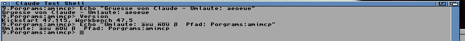

# amimcp — let Claude work on your Amiga

An [MCP](https://modelcontextprotocol.io) server that gives Claude hands on a
real Amiga. It can run AmigaDOS commands, read and write files, list drawers,
inspect the machine, capture the screen, and move the mouse and type on it — and
drive GUIs *by object* (click "the OK button"), run ARexx to script any
ARexx-aware app, and stream files of any size. The link is plain TCP by default,
or TLS on machines with AmiSSL.

You describe the problem; Claude pokes at the actual hardware.



*That is Claude clicking into a Shell on an A4000/060, typing a command, and
pressing Return — the umlauts routed through the Amiga's own German keymap.*

```
┌──────────────┐   MCP over stdio    ┌──────────┐   framed TCP   ┌────────────┐
│ Claude Code  │ ◄─────────────────► │  amimcp  │ ◄────────────► │  amiagent  │
│ (your Mac/PC)│  JSON-RPC 2.0       │ (python) │  port 7846     │ (the Amiga)│
└──────────────┘                     └──────────┘                └────────────┘
```

Two halves:

- **`amimcp`** — the MCP server, on the machine running Claude. Pure Python
  standard library: no venv, no pip, no lockfile to rot between the day you set
  this up and the evening two years later when the Amiga won't boot.
- **`amiagent`** — a small C daemon on the Amiga. AmigaOS 2.04 and up, bare
  68000, ~85 KB, needs nothing but `bsdsocket.library`.

## What Claude gets

| Tool | What it does |
|---|---|
| `amiga_shell` | Run an AmigaDOS command — stdout, stderr, and return code |
| `amiga_read_file` | Read a file; text inline, binaries base64 |
| `amiga_write_file` | Write or overwrite a file, binaries included |
| `amiga_list_dir` | List a drawer with sizes, protection bits, datestamps |
| `amiga_system_info` | Kickstart, CPU/FPU, free Chip/Fast, volumes, assigns |
| `amiga_screenshot` | Capture a screen as PNG — planar or RTG, whole or a region |
| `amiga_screens` | List every open screen, front to back, with geometry |
| `amiga_pointer` | Where the pointer is — no image transferred |
| `amiga_region_changed` | Checksum a region: "has anything changed yet?" |
| `amiga_click` | Move the pointer and click — single, double, any button |
| `amiga_drag` | Press, move, release — drag-and-drop, scrollbars, **menus** |
| `amiga_button` | Hold or release a button on its own |
| `amiga_move_mouse` | Move the pointer without clicking |
| `amiga_type` | Type text, mapped through the Amiga's own keymap |
| `amiga_key` | Press Return, Esc, F-keys and so on, with qualifiers |
| `amiga_break` | Ctrl-C a command left running by `amiga_shell` |
| `amiga_ui_tree` | The frontmost screen's window/gadget tree — the semantic view |
| `amiga_ui_click` | Click a gadget by identity (label/role/id), not coordinates |
| `amiga_menus` | Enumerate a window's menu strip, with shortcuts |
| `amiga_menu_select` | Invoke a menu item by name (via its keyboard shortcut) |
| `amiga_arexx` | Run an ARexx program — `ADDRESS` any app's port, get its RESULT |
| `amiga_rexx_ports` | List the public ARexx/message ports you can talk to |

Together those are enough to actually work: read a Startup-Sequence and fix it,
cross-compile a binary and push it over and run it, launch a GUI program and
drive it — **by object** (click "the OK button", pick a menu item) on standard
Intuition/GadTools GUIs, or by pixels everywhere else — or just look at what the
machine is showing when it has gone wrong.

`amiga_ui_tree` … `amiga_menu_select` are the **semantic layer** (agent 0.8.0+):
`amiga_ui_tree` reads the Amiga's GUI as a tree of windows and gadgets with
roles, labels and click-ready bounds, the way a screen reader sees a screen, so
Claude drives the machine by *what things are* instead of guessing pixels. It
sees standard Intuition/GadTools GUIs; custom-drawn content (MUI internals,
games, a Guru) stays the job of `amiga_screenshot`. Amiga-side detail is in
[PROTOCOL.md](PROTOCOL.md) (`UITREE` / `UIACT` / `MENUS`).

`amiga_arexx` and `amiga_rexx_ports` (agent 0.9.0+) add an **application
scripting layer**: ARexx is the Amiga's inter-app command bus, so Claude can
`amiga_rexx_ports` to see what's scriptable — Directory Opus, editors, comms,
players — then `amiga_arexx` with `address 'PORT'; command` to drive it and read
the result. Pixels, objects, and now app scripting: three ways to reach the
machine.

The scripting runs the other way too (agent 0.11.0+): the agent opens a local
ARexx port, **`AMIAGENT`**, so Amiga applications and plain ARexx scripts can
drive its input machinery themselves — no network client, no AI:

```rexx
address AMIAGENT
'ACTIVATEWINDOW "CHAT --*"'      /* rc=0 found+activated, rc=5 not found */
'ENTERTEXT "hello there<enter>"' /* keymap-correct, <key> tokens inline  */
```

Commands: `ACTIVATEWINDOW` (AmigaDOS wildcards, RESULT = matched title),
`ENTERTEXT`/`TYPE` (commodities-style tokens: `<enter>`, `<f1>`, `<ctrl c>`,
`<shift tab>`, `<<` for a literal `<`), `KEY`, `VERSION`, `HELP`. Check
`show('P','AMIAGENT')` and fall back gracefully — built for applications that
want optional input-injection without shelling out to helper binaries.

Two things are worth knowing before you drive a GUI:

- **Watch cheaply.** A full 1080p truecolour frame is ~6 MB over a ~1 MB/s link —
  about 7 seconds. Reading one status line as a *region* is effectively free, and
  `amiga_region_changed` answers "has it finished drawing?" in four bytes. Poll
  with hashes; capture pixels only when you need to look.
- **Two kinds of pointer.** `amiga_click` warps the Intuition pointer, which
  Intuition applications follow. SDL programs — games, ScummVM — track raw mouse
  *deltas* and keep their own cursor, so they never see the warp and the click
  lands wherever they still believe the pointer is. Pass `relative: true` for
  those. And an Amiga menu is opened by *holding* the right button and moving,
  so it needs `amiga_drag`, not a click.

## 1. Install the agent on the Amiga

### Download the release

Grab [`amiagent-0.11.0.lha`](https://github.com/thomas-luebker/amimcp/releases/latest)
and unpack it on the Amiga. It contains `amiagent` (68000, runs on everything)
and `amiagent.020` (68020+), plus two status monitors you can run next to it:
`amimon` (GadTools, runs on any OS 2.04+ machine) and `amimon-mui` (MUI 3.8+,
for the people whose Amiga already looks like YAM). The icons are classic
planar images with a GlowIcon appendix, so OS 3.5+/3.2 shows them in colour
with real transparency.

### With [amipkg](https://github.com/thomas-luebker/amipkg)

```
amipkg install amiagent
```

### Or build it yourself

Needs an m68k-amigaos cross-toolchain —
[AmigaPorts/m68k-amigaos-gcc](https://github.com/AmigaPorts/m68k-amigaos-gcc),
the maintained descendant of bebbo's amiga-gcc. (Bebbo's own repository is gone
as of 2026-08-07; AmigaPorts is where it lives now.) Cross-compile on any
machine that has it:

```sh
cd agent && make                # 68000 baseline, runs on every Amiga
cd agent && make CPU=68020      # 68020+ build
```

Copy the resulting `amiagent` to the Amiga.

> If the link fails with an undefined `IntuitionBase`, your toolchain doesn't
> auto-open intuition/graphics. Rebuild with `make OWNBASES=1`.

## 2. Start it

Bring up your TCP/IP stack (Roadshow, AmiTCP, or the emulator's `bsdsocket`
emulation), then from a Shell:

```
amiagent TOKEN=pickasecret
```

It prints that it is listening on port 7846 and waits. **Ctrl-C** stops it; if
you backgrounded it, find it with `Status` and `Break <n> C`.

Options: `PORT/N` (default 7846), `TOKEN/K`, `QUIET/S`.

To start it at boot, add this to `S:User-Startup`, **after** your TCP stack
comes up:

```
run >NIL: amiagent TOKEN=pickasecret QUIET
```

### Watch it work: amimon and amimon-mui

The archive ships a status monitor you run **on the Amiga itself**, in two
flavours showing exactly the same thing:

- **`amimon`** — GadTools, zero dependencies, runs on any OS 2.04+ machine.
- **`amimon-mui`** — the same monitor as a resizable MUI window that follows
  your MUI settings. Needs MUI 3.8+ (`muimaster.library` v19); without MUI it
  says so and points you at `amimon`.

Double-click either in the drawer, or from a Shell:

```
run >NIL: amimon
```

It finds the agent over local IPC (a named public semaphore — no network, no
configuration) and updates twice a second: agent version and port, state, the
request in flight, the last command, requests answered/failed, the client's
address, a self-reported "Driver" label, and uptime. Start it before or after
the agent, in any order — the fields fill in when the agent appears and say
"not found" when it is gone.

Two lines are worth a glance: the **Agent** row warns `OPEN, no token` if the
agent runs unprotected, and the **Driver** row is whatever the client claims
to be (`Claude Code / ...`) — a label the Amiga cannot verify, which is why it
sits below the client's real IP address.

## 3. Point your assistant at it

```sh
./install.sh 192.168.1.42 pickasecret
```

That probes the Amiga first, then registers the server with Claude Code. Or do
it by hand:

```sh
claude mcp add amiga \
  --env AMIGA_HOST=192.168.1.42 \
  --env AMIGA_TOKEN=pickasecret \
  -- python3 /path/to/amimcp/server/amimcp.py
```

For **Claude Desktop**, add this to `claude_desktop_config.json`:

```json
{
  "mcpServers": {
    "amiga": {
      "command": "python3",
      "args": ["/path/to/amimcp/server/amimcp.py"],
      "env": {
        "AMIGA_HOST": "192.168.1.42",
        "AMIGA_TOKEN": "pickasecret"
      }
    }
  }
}
```

Start a new session and ask Claude to check the Amiga.

### Other MCP clients — Codex, Cursor, Zed, Cline…

MCP is an open standard, and `server/amimcp.py` is an ordinary **stdio MCP
server**: it speaks JSON-RPC over stdin/stdout and takes its configuration from
environment variables. Anything that can launch an MCP server can therefore
drive the Amiga — the server does not know or care which model is on the other
end.

Only the config file shape differs. **OpenAI Codex CLI** (`~/.codex/config.toml`)
uses TOML:

```toml
[mcp_servers.amiga]
command = "python3"
args = ["/path/to/amimcp/server/amimcp.py"]
env = { AMIGA_HOST = "192.168.1.42", AMIGA_TOKEN = "pickasecret" }
```

**Google Gemini CLI**, **Cursor**, **Zed**, **Cline**, **Continue**,
**Windsurf**, **LM Studio** and **Goose** take the same `mcpServers` JSON block
shown above for Claude Desktop, in their own settings file. Check your client's
current docs for the exact path — these move.

So by model:

| Model | Reach it through |
|---|---|
| **Claude** (Anthropic) | Claude Code, Claude Desktop — *tested* |
| **GPT / ChatGPT** (OpenAI) | Codex CLI |
| **Gemini** (Google) | Gemini CLI |
| **Local / open weights** | LM Studio, Goose, Cline, Continue |
| **Whatever your editor uses** | Cursor, Zed, Windsurf |

> Tested against Claude Code and Claude Desktop. The rest follow from it being a
> standard stdio server rather than from me having run all of them; if one needs
> something different, please open an issue and say what.

Requires Python 3 — standard library only, no `pip install`, no venv.

### Check the link without involving an LLM

```sh
AMIGA_HOST=192.168.1.42 AMIGA_TOKEN=pickasecret python3 server/amimcp.py --probe
```

This skips MCP entirely, so a failure here is a network or agent problem rather
than a client one.

## Environment

| Variable | Default | Meaning |
|---|---|---|
| `AMIGA_HOST` | *(required)* | The Amiga's IP address or hostname |
| `AMIGA_PORT` | `7846` | Port `amiagent` listens on |
| `AMIGA_TOKEN` | *(none)* | Must match the agent's `TOKEN=` |
| `AMIGA_TIMEOUT` | `30` | Default per-request timeout, seconds |

## Security — read this before opening the port

`amiagent` runs arbitrary commands for anyone who can reach its port. The
default transport is plain TCP — requiring encryption just to reach the machine
you are trying to repair would defeat the purpose.

So, whatever else you do: **set a `TOKEN`, keep it on a LAN you trust, and never
forward the port.** Without a token, anything on your network segment can run
`Format` on your system partition. The agent warns loudly when started without
one.

**Optional TLS (agent 0.9.0+).** On a machine with [AmiSSL](http://aminet.net/package/util/libs/AmiSSL)
installed, build the agent with `make SSL=1` and it opens a second, encrypted
listener (the plain port + 1). The bundled clients — amifleet and Amiga Imager —
try TLS first and fall back to plain automatically, pinning the agent's
self-signed certificate trust-on-first-use (like SSH). Fast machines (68040/060,
PiStorm, Vampire) handle it comfortably; slower ones stay on plain. With TLS the
token and everything else travels encrypted; without it the token is compared
byte-for-byte and travels in cleartext, so it stops a stray port scan, not
someone with a packet sniffer on your LAN.

## Verified on

An A4000/060 running Kickstart 47.115 / Workbench 47.5 (AmigaOS 3.2.3) with
Roadshow and a 1920×1080 Picasso96 RTG screen. Confirmed against that machine:
shell with stdout+stderr and return codes, file read/write, directory listing,
system info, native truecolor screen capture through `cybergraphics.library`,
SGrab capture as the fallback, mouse move/click, and typing — including
`äöü ÄÖÜ ß` correctly produced through the machine's German keymap.

Transfer runs at roughly 830 KiB/s, so a full 1920×1080 truecolor grab is 6.2 MB
and about 7 seconds on the wire; the PNG that reaches Claude is around 850 KiB.

## Known limits

- **One command at a time.** Commands run in a child process with a deadline,
  so a program waiting for input no longer wedges the agent — everything else
  keeps working and `amiga_break` sends it Ctrl-C. But a stuck command does
  block later `amiga_shell` calls until it is broken or finishes.
- **The client and agent must be the same version.** The wire format changed in
  0.3.0; mixing 0.2.0 with 0.3.0 produces confusing errors rather than a clean
  refusal. `--probe` prints the agent's version.
- **stderr needs OS 3.2+.** `SYS_Error` arrived in `dos.library` v47, so on 3.2
  and later stderr is captured and appended after a `--- stderr ---` marker.
  Older systems get stdout only.
- **Screenshots take one of two routes.** The agent captures planar screens
  itself (OS 3.0+, ≤256 colours) and truecolor/RTG screens through
  `cybergraphics.library`, which Picasso96 and CyberGraphX both provide. If
  neither fits, it falls back to running `C:sgrab` on the Amiga and fetching the
  file — SGrab compresses on the Amiga, so it transfers far less. SGrab's JPEG
  mode additionally needs `jpeg.library`; PNG does not.
- **One command at a time**, one connection at a time.
- **16 MiB per frame.** A single request/response is capped at 16 MiB; the fleet
  clients stream larger files past it in pieces (chunked upload via `Join`,
  download via `GETRANGE`). The MCP file tools are one frame each.

## How it works

[`PROTOCOL.md`](PROTOCOL.md) documents the wire format and, more usefully, why
each part looks the way it does — the framing, why there is one command per
connection, how input events are injected, and the `System()` file-handle
ownership rule that caused the first real bug found on hardware.

## Developing without an Amiga

`tests/fake_agent.py` speaks the same wire protocol against a sandbox directory,
so you can build and debug the whole stack on your desktop and then change one
environment variable to hit real hardware:

```sh
python3 tests/fake_agent.py --port 7846 --root /tmp/fakeamiga
AMIGA_HOST=127.0.0.1 python3 server/amimcp.py --probe
```

It is a test double, not an emulator: `EXEC` understands a handful of
AmigaDOS-shaped commands rather than actually running AmigaDOS.

```sh
./run_tests.sh     # 69 tests, no hardware and no cross-compiler needed
```

## Layout

```
PROTOCOL.md          the wire format, and why it looks like that
agent/amiagent.c     the Amiga daemon
agent/amimon.c       GadTools status monitor (watches the agent's board)
agent/amimon-mui.c   the same monitor as a MUI app (needs MUI 3.8+ to run)
agent/muistubs.c     out-of-line MUI varargs stubs (see its header comment)
agent/status.h       the local status board amimon/amimon-mui read
agent/proto.h        constants shared with the Python side
agent/Makefile       m68k-amigaos-gcc build
agent/vendor/cgx/    CyberGraphX interface files (see its README)
agent/vendor/mui/    MUI 3.8 developer headers (compile-time only)
server/amimcp.py     MCP server (stdio JSON-RPC)
server/amiga.py      wire protocol client
server/png.py        chunky/RGB → PNG, stdlib zlib
tests/fake_agent.py  host-side stand-in for the Amiga
tests/               end-to-end and protocol-drift tests
tools/amibench/      CPU/memory benchmark for comparing Amigas
tools/amifleet/      macOS fleet console — ARD-style tiles, shell, live screen
tools/lhapack/       builds the release archive (macOS has no LHA writer)
tools/mkicon/        writes the .info icons (classic planar + GlowIcon)
install.sh           register with Claude Code
```

## Also here: amibench

[`tools/amibench`](tools/amibench) is a small CPU/memory benchmark for answering
"how much faster is machine A than machine B". It is standalone — it needs
nothing else installed — and there is a ready-made binary on the
[releases page](https://github.com/thomas-luebker/amimcp/releases/latest).

It is built for 68020 so **one identical binary** runs on an 020, an 040, an 060
and on Emu68's JIT; comparing separate builds would measure the compiler as much
as the machine. Each phase self-calibrates to a ≥2 s window, because a fixed
workload is useless across a 70× speed range — a PiStorm finished an entire
50 MB memcpy inside a *single* 1/50 s tick.

An A1200 + PiStorm32-lite measured ~73× an A4000/060 at 50 MHz on CPU and Fast
RAM, reproducible to within 3% across two runs, and cross-checking against
SysInfo putting the same pair 50.1× apart. Chip
RAM does not follow — see [its README](tools/amibench/README.md) for why that
matters more than the headline number.

## Also here: amifleet

[`tools/amifleet`](tools/amifleet) is a native macOS app — an Apple-Remote-
Desktop for your Amigas. It shows every machine on your network as a tile with
its live status, lets you pull a report and run AmigaDOS commands, and opens a
live view of a machine's screen you can click and type into. It speaks the
amiagent protocol directly, so there is **nothing extra to install** — it is
not the MCP server. See the [**User Guide**](tools/amifleet/docs/GUIDE.md) to
get started, or the [tool README](tools/amifleet/README.md) to build it.

## Licence

Apache 2.0 — see [LICENSE](LICENSE). Vendored CyberGraphX interface files keep
phase5's terms; see [NOTICE](NOTICE) and
[`agent/vendor/cgx/README.md`](agent/vendor/cgx/README.md).
