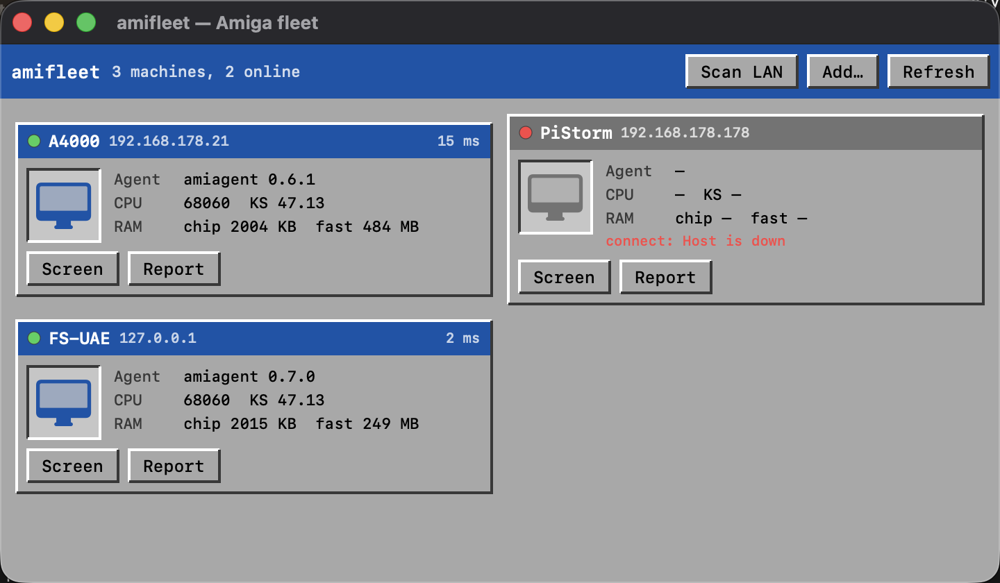

# amifleet

An Apple-Remote-Desktop-style console for every Amiga on your LAN. A native
macOS/SwiftUI app that speaks the amimcp wire protocol
([`PROTOCOL.md`](../../PROTOCOL.md)) **directly** — no MCP server, no Python,
no LLM in the loop. Dressed like a Workbench 3.x window because of course it is.



> **New here?** The [**User Guide**](docs/GUIDE.md) covers install, connecting
> your Amigas, the live screen, security and troubleshooting. This README is
> the developer/build side.

## What it does

- **Fleet board** — one beveled tile per machine, polled every 5 s: online
  light, latency, agent version, CPU, Kickstart, free Chip/Fast RAM. A machine
  that drops offline keeps showing its last good report, greyed.
- **Scan LAN** — sweeps the /24 of your first configured machine for port 7846
  and adds every agent it finds.
- **Report & Shell** — the full `INFO` report, plus an AmigaDOS shell that runs
  commands through `EXEC` and shows the return code and captured output.
- **Live screen** ("VNC") — the machine's frontmost screen, refreshed the way
  the protocol intends: poll the cheap `HASH` twice a second (no pixels move)
  and pull a full `SHOT` only when the checksum changes. Mouse clicks and the
  keyboard are forwarded through `INPUT`, mapped from the fitted image back to
  real Amiga screen pixels. Chunky pixels are shown unscaled — no smoothing.

Both palette (`fmt 1`) and RGB24/RTG (`fmt 2`) captures render. A full 1080p
RTG frame is a multi-megabyte, multi-second fetch on a real 68060; the header
shows the fetch time so slowness is visible, not mysterious.

## Run it

```
swift run          # from tools/amifleet
```

## Connecting to your fleet

**There is nothing else to install — amifleet is not the MCP server.** It talks
the amiagent wire protocol straight over TCP, so all you need is `amiagent`
running on each Amiga (`amiagent TOKEN=yoursecret`, port 7846). The MCP server
in this repo (`server/`) is a *separate* thing, only for letting an LLM drive a
machine; a person using amifleet never touches it.

A fresh launch starts empty. Two ways in:

- **Scan my network** — sweeps this Mac's own subnet(s) for agents on port 7846
  and adds every one it finds (including token-protected ones). You give it the
  token your agents use so it can talk to them.
- **Add a machine…** — type a host, port and token by hand (for a machine on
  another subnet, or reached through a port-forward like a local FS-UAE).

Machines persist in `UserDefaults`; right-click a tile to **Edit…** its token
or **Remove** it. Everything is plain TCP request/response, so it works against
any `amiagent` 0.1.1+ — the live screen needs 0.5.0+ for `HASH`, and RTG
capture needs a `cybergraphics.library` screen.

## Build a signed release

`package.sh` builds `amifleet.app` — a universal (arm64 + x86_64) binary with
the icon, signed with a Developer ID and hardened runtime:

```
./package.sh                        # build + Developer ID sign + verify
./package.sh --notarize <profile>   # ... then notarize, staple, and make a DMG
```

Notarization needs an Apple notary credential stored once as a keychain
profile (either form works):

```
xcrun notarytool store-credentials amifleet-notary \
    --apple-id you@example.com --team-id Y38P2BJ4DM --password <app-specific-pw>
# or an App Store Connect API key:
xcrun notarytool store-credentials amifleet-notary \
    --key AuthKey_XXXX.p8 --key-id XXXX --issuer <issuer-uuid>
```

The icon is rendered from `icon/makeicon.swift` (CoreGraphics, no deps);
`icon/icon-1024.png` is the committed master `package.sh` slices into the
`.icns`.

It starts with the three machines from the amimcp fleet (A4000, PiStorm,
FS-UAE), all on token `a4000`; edit or add your own with **Add…**, and the
list persists in `UserDefaults`. Everything is a plain TCP request/response, so
it works against any `amiagent` 0.1.1+ — the live screen needs 0.5.0+ for
`HASH`, and RTG capture needs a `cybergraphics.library` screen.

## How it's built

- `AmigaKit/AmigaWire.swift` — the protocol as a standalone library, on
  blocking BSD sockets (one request per connection, AUTH-then-command,
  big-endian framing) with async wrappers. Shared by the GUI and the test CLI.
- `amifleet/Models.swift` — the `Fleet` store: polling, discovery, persistence.
- `amifleet/{FleetView,DetailView,ScreenView}.swift` — the three window kinds.
  `ScreenView` drops to an AppKit `NSView` to catch raw mouse and key events
  and translate macOS keycodes to Amiga rawkeys.

## Testing the input path

`amitest` is a headless harness that drives the **exact same `AmigaKit` code**
the GUI's screen window calls, so the click/type/rawkey path can be verified
against real hardware without automating the GUI:

```
swift run amitest <host> [token]              # full input self-test
swift run amitest <host> [token] shot out.ppm # just grab a frame
```

The self-test opens a shell window on the Amiga, clicks to focus it, types an
`Echo "<marker>"` and presses Return — so a screenshot of the machine shows the
marker echoed back if every step worked. Verified on all three fleet machines
(real A4000, PiStorm/Emu68, FS-UAE): the marker appears in each shell.

This is a client, not a server: it holds no state on the Amiga and can't do
anything a shell couldn't. Same trust model as the rest of amimcp — keep it on
a LAN you trust and give every agent a token.
