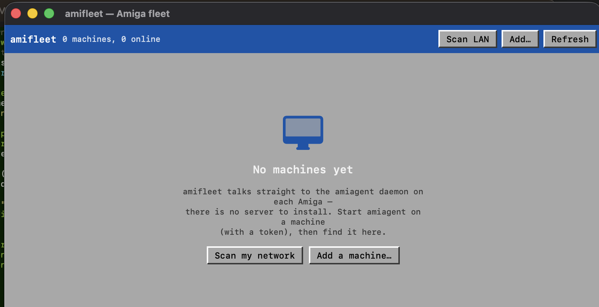
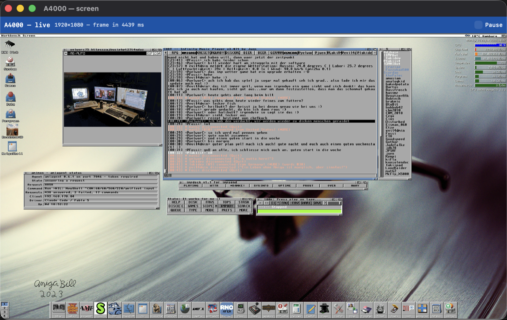

# amifleet — User Guide

amifleet is a Mac console for the Amigas on your network — an Apple-Remote-
Desktop for classic Amigas. It shows every machine as a tile, lets you pull a
system report, run AmigaDOS commands, and open a live view of a machine's
screen that you can click and type into.

It connects **directly** to the `amiagent` daemon on each Amiga. There is no
server to install and nothing to configure on the Mac beyond pointing it at
your machines.

---

## 1. What you need

- **A Mac running macOS 13 (Ventura) or later.**
- **`amiagent` running on each Amiga** you want to reach — the small daemon
  from the [amimcp release](https://github.com/thomas-luebker/amimcp/releases/latest).
  Any version works for the board and shell; the live screen needs 0.5.0+, and
  a colour/RTG capture needs a `cybergraphics.library` (Picasso96 / CyberGraphX)
  screen. amiagent runs on any Amiga with OS 2.04+ and a TCP/IP stack.

> **amifleet is not the MCP server.** The `server/` part of amimcp exists only
> so an AI assistant can drive an Amiga. As a person using amifleet you never
> touch it — the app speaks the amiagent protocol itself.

---

## 2. Install

1. Open the `amifleet-x.y.z.dmg` and drag **amifleet** to your **Applications**
   folder.
2. Launch it from Applications. Because the app is signed and notarised by its
   developer, macOS opens it normally.
   - *If you built it yourself and skipped notarisation,* macOS Gatekeeper will
     block the first launch — right-click the app, choose **Open**, then
     **Open** again in the dialog. You only do this once.

---

## 3. Prepare your Amigas

On each Amiga, start the agent from a Shell with a shared secret token:

```
amiagent TOKEN=pickasecret
```

It listens on port **7846** and waits. To start it automatically at boot, add
this to `S:User-Startup`, **after** your TCP/IP stack comes up:

```
run >NIL: <path-to>/amiagent TOKEN=pickasecret QUIET
```

Use the **same token** on every machine and it is one field to fill in on the
Mac. (You *can* run without a token, but then anything on your network can run
any command on that Amiga — don't, unless it is a throwaway emulator.)

---

## 4. Connect to your fleet

The first launch is empty:



Two ways to add machines:

- **Scan my network** — sweeps your Mac's own local network for agents on port
  7846 and adds every one it finds, including token-protected ones. Enter the
  token your agents use so amifleet can talk to them.
- **Add a machine…** — type a name, host/IP, port and token by hand. Use this
  for a machine on a different subnet, or one reached through a port-forward
  (for example a local FS-UAE mapped to `127.0.0.1`).

Your list is saved between launches. Right-click any tile to **Edit…** its
token or **Remove** it.

---

## 5. The fleet board


Each tile polls its machine every few seconds and shows:

- a **status light** — green when the agent answers, red when it doesn't;
- **round-trip latency** in milliseconds;
- the **agent version**, **CPU** and **Kickstart**, and **free Chip / Fast RAM**.

A machine that goes offline keeps its last-known details (greyed) and shows why
it can't be reached — `Host is down`, `connect timeout`, and so on — so you can
tell "switched off" from "wrong token" at a glance.

Two buttons on every tile: **Screen** opens the live view, **Report** opens the
report-and-shell window. **Refresh** in the toolbar re-polls everything now.

---

## 6. Report & Shell

The **Report** window has the full system report on the left — every field the
agent publishes — and an **AmigaDOS shell** on the right. Type a command
(`Dir SYS:`, `Version`, `Avail`, `List Work:`…), press Return, and you get the
return code and captured output, exactly as if you were at the machine. Output
on OS 3.2+ includes stderr.

Commands run on the Amiga with a deadline, so one that hangs won't wedge the
app; everything else keeps working while it runs.

---

## 7. Live screen



**Screen** opens a live view of the machine's frontmost display. amifleet is
frugal about it: twice a second it asks the agent only whether the screen has
*changed* (a cheap checksum, no pixels), and pulls a full frame only when it
has. The header shows each frame's size and how long it took to fetch — a small
palette screen is instant; a full 1920×1080 truecolour RTG desktop is several
megabytes and takes a few seconds on a real 68060, which is normal.

- **Click** anywhere to click there on the Amiga (left/right/middle mouse).
- **Type** to send keystrokes — text goes through the Amiga's own keymap, so
  your umlauts and symbols come out right.
- **Special keys** — Return, Tab, Esc, arrows, function keys, Delete — are
  forwarded too.
- **Pause** freezes the refresh (handy on a slow RTG link, or to stop pulling
  frames while you read).

**One limitation:** clicks move the Intuition pointer, which normal Workbench
and application windows follow. Programs that read the mouse *directly* — SDL
games, ScummVM — keep their own cursor and won't follow a remote click. Drive
those at the machine itself.

---

## 8. Security — please read

amiagent runs whatever commands it is sent, and the connection is **not
encrypted**. amifleet inherits that trust model:

- **Always set a token**, and keep it to yourself.
- **Keep it on a network you trust.** Never forward port 7846 through your
  router to the internet.
- The board's Agent row will warn **OPEN, no token** for any machine running
  unprotected — treat that as a to-do, not a feature.

The first time amifleet reaches out on your network, macOS may ask for **Local
Network** permission — allow it, or the app can't see your Amigas.

---

## 9. Troubleshooting

| Symptom | Likely cause / fix |
|---|---|
| Tile red, "Host is down" / "connect timeout" | The Amiga is off, the agent isn't running, or the IP is wrong. Start `amiagent`, check the address. |
| Tile red right after adding, token looks right | A **wrong token** makes the agent drop the connection. Right-click → Edit… and fix it. |
| **Scan** finds nothing | Your Mac's firewall may block it, or the Amigas are on a different subnet than the Mac — use **Add a machine…** with the exact IP. |
| Live screen is slow / multi-second frames | Expected for a large RTG desktop over a ~1 MB/s link. Use **Pause** when you don't need updates; a smaller screen mode captures far faster. |
| Live screen says "capture failed" | The agent is older than 0.5.0, or the screen mode can't be captured (needs OS 3.0+; colour needs `cybergraphics.library`). |
| Clicks in a game do nothing | That program tracks the mouse directly and can't be driven remotely (see §7). |

---

## 10. Uninstall

Quit amifleet and drag it from **Applications** to the Trash. It stores only a
small list of your machines in macOS preferences; nothing is installed
system-wide, and nothing changes on the Amigas.
